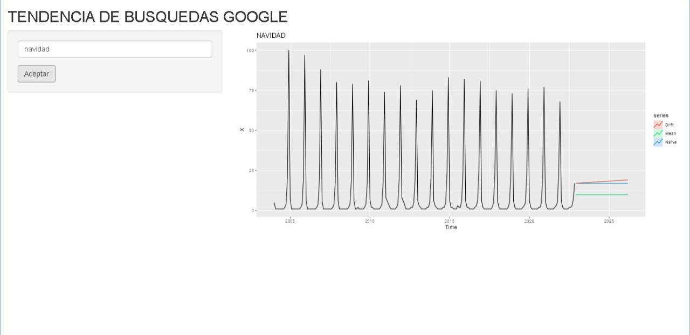

# TENDENCIA DE ACCCIONES



## LIBRERIAS NECESARIAS

```{r}
library(shiny)
library(gtrendsR)
library(fpp2)
library(tsbox)
library(xts)
```

## DESCRIPCION

La aplicación permite visualizar series de tiempo que corresponde a palabras clave en las búsquedas realizadas en el buscador google, usando en paquete "gtrendsR" que conecta con Google Trends.