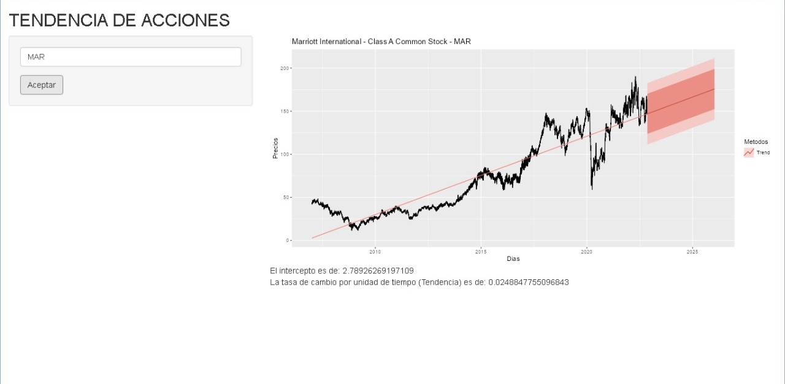

# TENDENCIA DE ACCCIONES



## LIBRERIAS NECESARIAS

```{r}
library(shiny)
library(quantmod)
library(fpp2)
library(tsbox)
```

## DESCRIPCION

La aplicación permite estimar la tendencia de series de tiempo que representan los precios de cierre de acciones por medio del método de minimos cuadrados ordinarios.

Para ejecutar la aplicación el usuario debe insertar el ticket de la empresa contizada en bolsa, en la sección del "input" y presionar aceptar, donde la aplicación renderizara un grafico donde muestra la tendencia ajustada y estimada.
